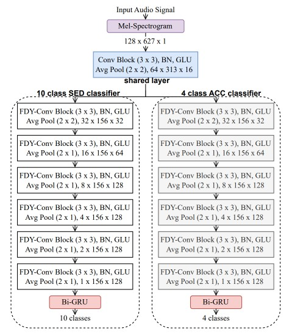

### DCASE 2022 Task 4 MTL Setup for Sound Event Detection in Domestic Environments.

---

## Requirements
The script `conda_create_environment.sh` is available to create an environment that runs the
following code (recommended to run line by line in case of problems).

## Description
In this study, we leverage some distinctive high-level acoustic characteristics of various sound events to assist the SED model training, without requiring additional labeled data. We use the DCASE Task 4 2022 dataset and categorize the 10 classes into four subcategories based on their high-level acoustic characteristics. We then introduce a novel multi-task learning framework that jointly trains the SED and high-level acoustic characteristics classification tasks using shared layers and weighted loss. Our method significantly improves the performance of the SED system, achieving a 36.3% improvement in terms of the polyphonic sound event detection score compared to the baseline on the DCASE 2022 Task 4 validation set.

## Dataset
You can download the development dataset using the script: `generate_dcase_task4_2022.py`.
The development dataset is composed of two parts:
- real-world data: this part of the dataset is composed of strong labels, weak labels, unlabeled, and validation data which are coming from Audioset.

- synthetically generated data: this part of the dataset is composed of synthetic soundscapes, generated using Scaper. 

### Usage:
Run the command `python generate_dcase_task4_2022.py --basedir="../../data"` to download the dataset (the user can change basedir to the desired data folder.)

If the user already has downloaded part of the dataset, it does not need to re-download the whole set. It is possible to download only part of the full dataset, if needed, using the options:

 - **only_strong** (download only the strong labels of the DESED dataset)
 - **only_real** (download the weak labels, unlabeled and validation data of the DESED dataset)
 - **only_synth** (download only the synthetic part of the dataset)

 For example, if the user already has downloaded the real and synthetic part of the set, it can integrate the dataset with the strong labels of the DESED dataset with the following command:

 `python generate_dcase_task4_2022.py --only_strong` 

 If the user wants to download only the synthetic part of the dataset, it could be done with the following command: 

 `python generate_dcase_task4_2022.py --only_synth`

### Development dataset

The dataset is composed of 4 different splits of training data: 
- Synthetic training set with strong annotations
- Strong labeled training set **(only for the SED Audioset baseline)**
- Weak labeled training set 
- Unlabeled in the domain training set

#### Synthetic training set with strong annotations

This set is composed of **10,000** clips generated with the Scaper soundscape synthesis and augmentation library. The clips are generated such that the distribution per event is close to that of the validation set.

The strong annotations are provided in a tab separated csv file under the following format:

`[filename (string)][tab][onset (in seconds) (float)][tab][offset (in seconds) (float)][tab][event_label (string)]`

For example: YOTsn73eqbfc_10.000_20.000.wav 0.163 0.665 Alarm_bell_ringing

#### Strong labeled training set 

This set is composed of **3,470** audio clips coming from Audioset. 

**This set is used at training only for the SED Audioset baseline.** 

The strong annotations are provided in a tab separated csv file under the following format:

`[filename (string)][tab][onset (in seconds) (float)][tab][offset (in seconds) (float)][tab][event_label (string)]`

For example: Y07fghylishw_20.000_30.000.wav 0.163 0.665 Dog

#### Weak labeled training set 

This set contains **1,578** clips (2,244 class occurrences) for which weak annotations have been manually verified for a small subset of the training set. 

The weak annotations are provided in a tab separated csv file under the following format:

`[filename (string)][tab][event_labels (strings)]`

For example: Y-BJNMHMZDcU_50.000_60.000.wav Alarm_bell_ringing,Dog

#### Unlabeled in the domain training set

This set contains **14,412** clips. The clips are selected such that the distribution per class (based on Audioset annotations) is close to the distribution in the labeled set. However, given the uncertainty on Audioset labels, this distribution might not be exactly similar.

## Training
We provide the following **setup** for the task:
- Multi-Task Learning Framework (MTL Framework)

### How to run the system
The **SED system** can be run from scratch using the following command:

`python train_sed_stage_two_MTL.py.py`

To run the **SED system** from scratch with Audioset External, use the following command:
`python train_sed_stage_two_MTL.py.py --strong_real`

---

Note that the default training config will use GPU 0. 
Alternatively, we provide tensorboard logs. The baseline can be tested on the development set of the dataset using the following command:

`python train_sed_stage_two_MTL.py.py --test_from_checkpoint /path/to/downloaded.ckpt`

The tensorboard logs can be tested using the command `tensorboard --logdir="path/to/exp_folder"`. 

**Hyperparameters** can be changed in the YAML file (e.g. lower or higher batch size).

Training can be resumed using the following command:

`python train_sed_stage_two_MTL.py.py --resume_from_checkpoint /path/to/file.ckpt`

#### Results:

| System              | PSDS1 | PSDS2 | PSDS1 + PSDS2 |
|---------------------|-------|-------|---------------|
| Baseline (Audioset)           | 0.351 | 0.552 | 0.903         | 
| Two-stage system (TSS)           | 0.472 | 0.721 | 1.193         | 
| TSS + MTL (α=0.5)                | 0.476 | 0.751 | 1.227         | 
| TSS + MTL (α=0.6)                | 0.457 | 0.740 | 1.197         | 
| TSS + MTL (α=0.7)                | 0.479 | 0.738 | 1.217         | 
| TSS + MTL (α=0.8)                | 0.480 | 0.751 | 1.231         | 
| TSS + MTL (α=0.9)                | 0.490 | 0.729 | 1.219         | 

#### References
[1] Delphin-Poulat, L. and C. Plapous, “Mean teacher with data augmentation for DCASE 2019 Task 4”, Technical Report, Detection and Classification of Acoustic Scenes and Events (DCASE) Challenge, 2019. 

[2] Turpault, N., R. Serizel, A. Shah, and J. Salamon, “Sound Event Detection in Domestic Environments with Weakly Labeled Data and Soundscape Synthesis”, Detection and Classification of Acoustic Scenes and Events (DCASE) Workshop, pp. 253–257, 2019.

[3] Ronchini, F., Serizel, R., Turpault, N., & Cornell, S., "The impact of non-target events in synthetic soundscapes for sound event detection", Detection and Classification of Acoustic Scenes and Events (DCASE) Workshop, 2021.

[4] Ronchini, F. and Serizel, R., "A Benchmark of State-of-the-Art Sound Event Detection Systems Evaluated on Synthetic Soundscapes," IEEE International Conference on Acoustics, Speech and Signal Processing (ICASSP), pp. 1031-1035, 2022.

[5] Khandelwal, T. and R. K. Das, “A Multi-Task Learning Framework for Sound Event Detection using High-level Acoustic Characteristics of Sounds”, Interspeech, 2023.
